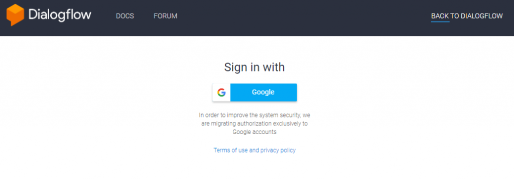
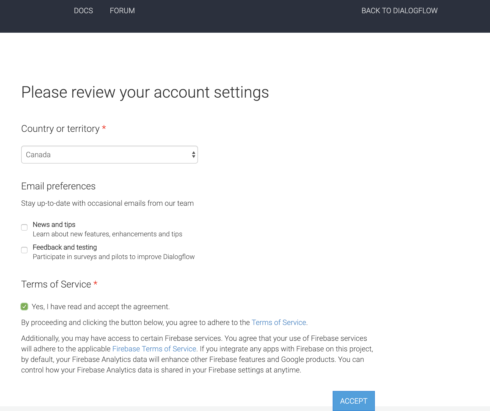
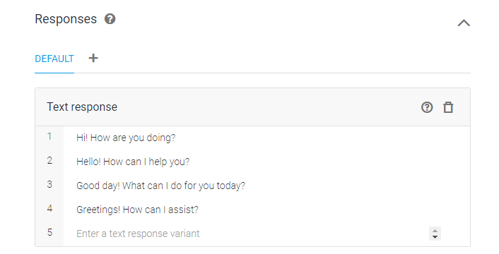
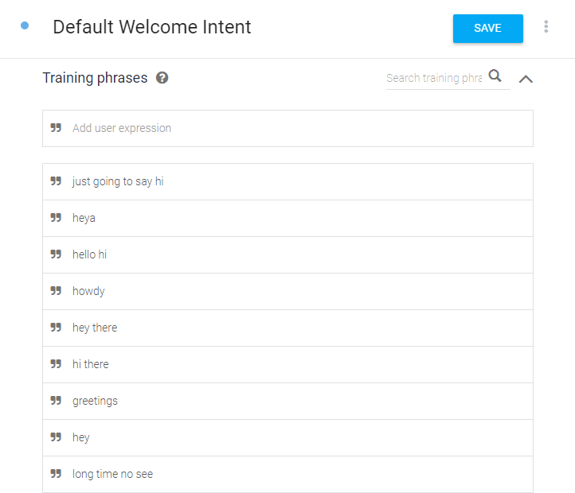
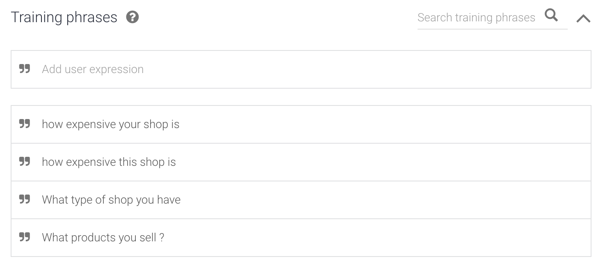
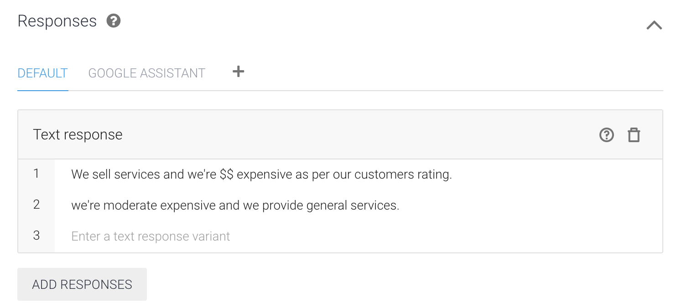
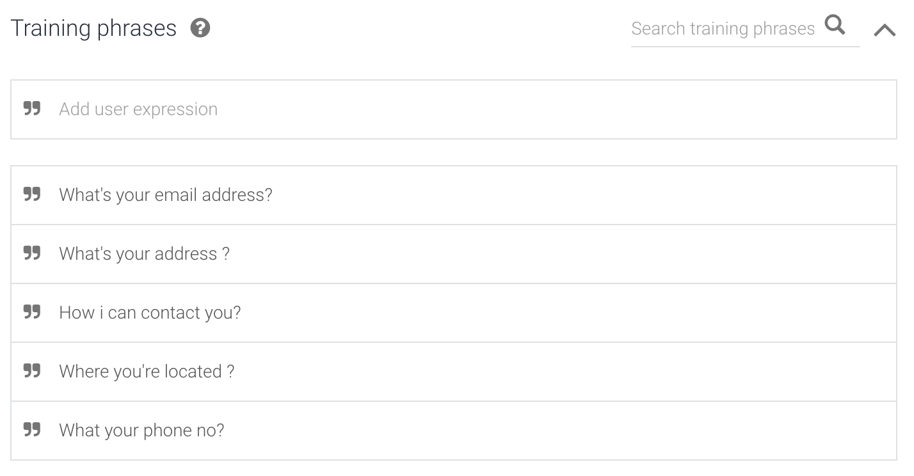
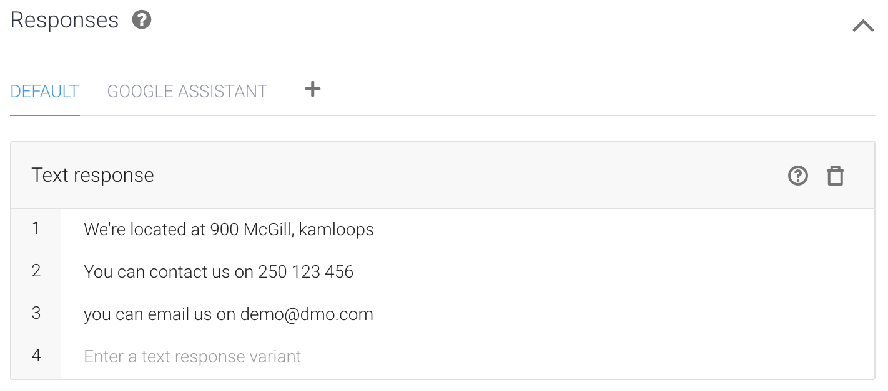
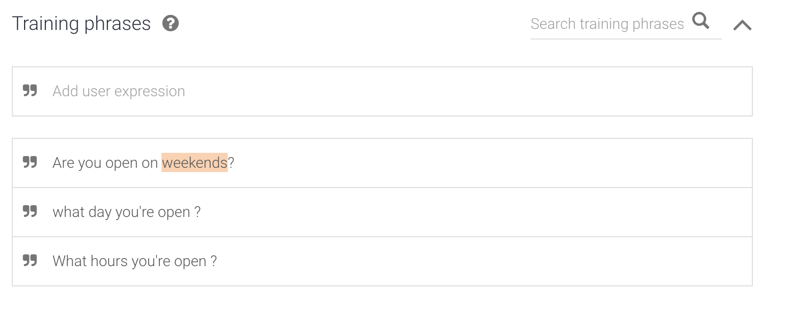
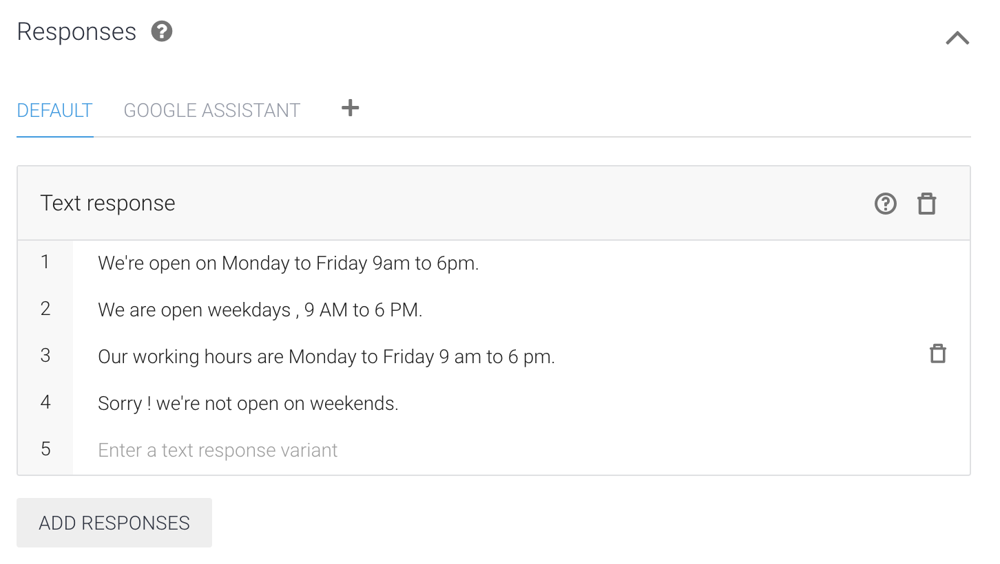

# Quick Review 

## 1. Google Signup

To start using Dialogflow you need to have a Google Account. If you are already using gmail, then you can login using that account. Or you can create a new Google account.



After logging in you will be redirected to account setting page. Where you can select your country and choose email preferences as per your choice. You have to check the terms of service checkbox and click Accept button to proceed further.



Now you will land on welcome page of Dialogflow to kickoff your journey in exciting world of chatbot development.

## 2. Agent creation

To start with a new chatbot development in Dialogflow, we need to create an agent.

Provide a name for your agent and select default timezone. Choose default language as per your preference.


## 3. Intents
Intents are basic building blocks of chatbot in Dialogflow. Intents map user input to responses. Dialogflow provides two default intents ‘Default Welcome Intent’ and ‘Default Fallback Intent’ for each agent you create.

Let’s have a look at what these default intents do.


#### a. Default Fallback Intent
When we create a new agent, Default Fallback Intent is automatically configured with various responses. Default Fallback Intent is called when user’s input does not match with any other intent.

We can change text responses in the Default Fallback Intent. When user enters input and that doesn’t match with any intent the

Default Fallback Intent select random response from the list of responses.



#### b. Default Welcome Intent
Default Welcome Intent is automatically configured with various training phrases and responses. This intent will be triggered when user starts interaction with our chatbot. Even when he hasn’t provided any input this intent will be invoked.

Now click on Default Welcome Intent. You can see Contexts, Events, training phrases, Action and parameters and Responses.

We can start building our bot by adding Training phrases and Responses

Training Phrases are used for matching with user inputs

When User’s input matches with any of these training phrases Default welcome intent triggers.

Response will be returned randomly from the list of responses.



## 4. Create New Intent
To create a new intent either click on + symbol next to intents menu on left sidebar or click on “CREATE INTENT” button on top.


Enter Intent name and click on save button.

Under Training Phrases section, we can see textbox “Add user expression”. Enter your training phrases and click save button.

You need to enter training phrases as per the intent. You need to decide what type of user input will invoke this intent. For example, for this Introduction intent, I have added “tell me about yourself” and “introduce yourself”.


Now scroll down to responses section. Every intent must have at least one response. In the Text response box, type a response and press Enter. We can add multiple responses. Intent use random responses from the list you have entered. Don’t forget to click on save button otherwise your changes won’t take effect.



## 5. Creating other sample intents

Now create few more intents as named "ContactInfo" and "WorkingHours"

Add few training phrases in ContactInfo:

```
- Where you're located ?
- How i can contact you?
- What's your address ?
- What's your email address?
- What your phone no?
```


Add responses to ContactInfo intent

```
- We're located at 900 McGill, kamloops
- You can contact us on 250 123 456
- you can email us on demo@dmo.come
```


> Its good to have different responses. Interaction can be better with various different responses

Sample training phrases for Working Hours
```
- Are you open on weekends?
- what day you're open ?
- what hours you're open ?
```


Sample Responses for Working Hours

```
- We're open on Monday to Friday 9am to 6pm.
- We are open weekdays, 9AM to 6 PM.
- Our Working hours are Monday to Friday 9am to 6 pm.
- Sorry! we're not open weekends.
```
